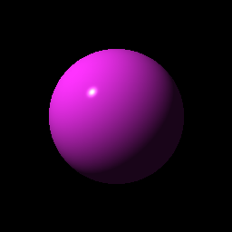
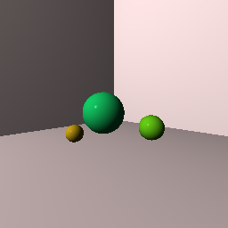

# Sunhouse

A simple raytracer built in Rust as I work through _[The Ray Tracer Challenge](http://raytracerchallenge.com)_.

You're of course welcome to poach whatever you want from this, but I'd advise you to probably just walk right on by my step definitions for the Cucumber tests, because they were written in the most absolutely brainless head-down one-thing-at-a-time I'm-the-Juggernaut way possible. Which is arguably fine for this sort of project, but, y'know.

Progress:
- [x] Tuples, Points, and Vectors
  - [x] Tuples
  - [x] Operations
- [x] Drawing on a Canvas
  - [x] Representing Colors
  - [x] Implementing Color Operations
  - [x] Creating a Canvas
  - [x] Saving a Canvas
- [x] Matrices
  - [x] Creating a Matrix
  - [x] Multiplying Matrices
  - [x] The Identity Matrix
  - [x] Transposing Matrices
  - [x] Inverting Matrices
- [x] Matrix Transformations
  - [x] Translation
  - [x] Scaling
  - [x] Rotation
  - [x] Shearing
  - [x] Chaining Transformations
- [x] Ray-Sphere Intersections
  - [x] Creating Rays
  - [x] Intersecting Rays With Spheres
  - [x] Tracking Intersections
  - [x] Identifying Hits
  - [x] Transforming Rays and Spheres
  - 
- [x] Light and Shading
  - [x] Surface Normals
  - [x] Reflecting Vectors
  - [x] The Phong Reflection Model
  - 
- [x] Making a Scene
  - [x] Building a World
  - [x] Defining a View Transformation
  - [x] Implementing a Camera
  - 
- [x] Shadows
  - [x] Lighting in Shadows
  - [x] Testing for Shadows
  - [x] Rendering Shadows
  - 
- [x] Planes
  - [x] Refactoring Shapes
  - [x] Implementing a Plane
  - 
- [ ] Patterns
  - [ ] Making a Striped Pattern
  - [ ] Transforming Patterns
  - [ ] Generalizing Patterns
  - [ ] Making a Gradient Pattern
  - [ ] Making a Ring Pattern
  - [ ] Making a 3D Checkered Pattern
- [ ] Reflection and Refraction
  - [ ] Reflection
  - [ ] Transparency and Refraction
  - [ ] Fresnel Effect
- [ ] Cubes
  - [ ] Intersecting a Ray With a Cube
  - [ ] Finding the Normal on a Cube
- [ ] Cylinders
  - [ ] Intersecting a Ray With a Cylinder
  - [ ] Finding the Normal on a Cylinder
  - [ ] Truncating Cylinders
  - [ ] Capped Cylinders
  - [ ] Cones
- [ ] Groups
  - [ ] Implementing Groups
  - [ ] Finding the Normal on a Child Object
  - [ ] Using Bounding Boxes to Optimize Large Scenes
- [ ] Triangles
  - [ ] Triangles
  - [ ] Wavefront OBJ Files
  - [ ] Smooth Triangles
  - [ ] Smooth Triangles in OBJ Files
- [ ] Constructive Solid Geometry (CSG)
  - [ ] Implementing CSG
  - [ ] Coloring CSG Shapes
- [ ] Next Steps
  - [ ] Area Lights and Soft Shadows
  - [ ] Spotlights
  - [ ] Focal Blur
  - [ ] Motion Blur
  - [ ] Anti-Aliasing
  - [ ] Texture Maps
  - [ ] Normal Perturbation
  - [ ] Torus Primitive